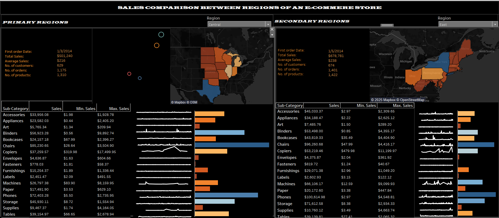

# 📊 Sales Comparison Dashboard — Tableau

📊 **[Click here to interact with the live visualization](https://public.tableau.com/shared/9M2XYZNHJ?:display_count=n&:origin=viz_share_link)**
## 📌 Overview  
This project showcases an **interactive Tableau dashboard** designed to compare sales performance across different categories, regions, and periods. It demonstrates advanced data visualization techniques and analytical storytelling skills to uncover trends, patterns, and actionable insights.

## 🎯 Objective  
To build a dynamic tool that helps stakeholders quickly compare sales metrics, identify growth opportunities, and monitor performance against set targets.

## 📂 Dataset  
- **Source:** _ Kaggle_
- **Key Fields:** Product Category, Region, Sales Amount, Profit, Order Date, etc.

## 🛠 Tools & Technologies  
- **Tableau Desktop/Public** — for dashboard creation  
- **Excel / CSV** — for data preparation  

## 🔍 Methodology  
1. **Data Preparation** — cleaned and formatted the dataset, handled missing values.  
2. **Exploratory Analysis** — identified KPIs for comparison.  
3. **Dashboard Design** — created visualizations (bar charts, line graphs, maps) with interactive filters.  
4. **Insights Extraction** — highlighted sales trends, top-performing categories, and underperforming regions.

## 🚀 How to Use  
1. View the live dashboard on [Tableau Public](https://public.tableau.com/shared/9M2XYZNHJ?:display_count=n&:origin=viz_share_link).  
2. Use the filters to explore sales by category, region, and date.  
3. Hover over charts to see detailed tooltips.
